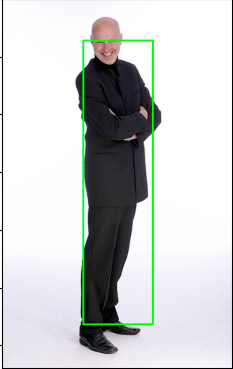
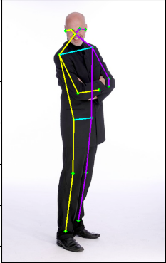

# Research and Deployment about Edge AI.
This is the final project about Computer Vision using Deep learning to train model and deploy on Edge Device.

## Pose detection, estimation and classification.

### Structure:
*   Project features will be

    *   Detection: Output expected.
    
    

    *   Estimation: Output expected.
    
    
 
    *   Classification

### Step by step
- Collect data
- Using TFLite model to estimation yoga pose and get landmarks into csv file
- Define model to training with input as embedding vector from landmark in csv file
- Evaluate model
- Convert model -> TFLite format to deploy on Edge device 
- Testing
