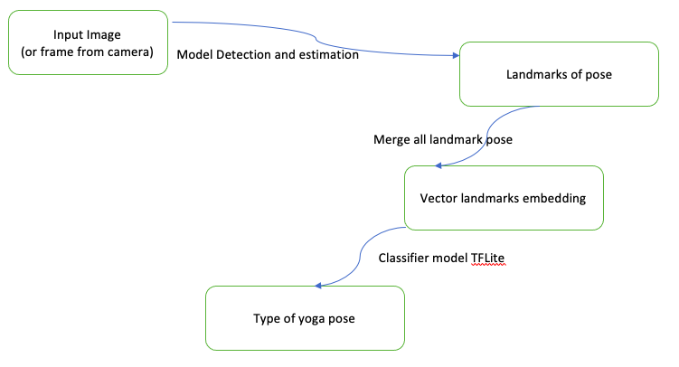
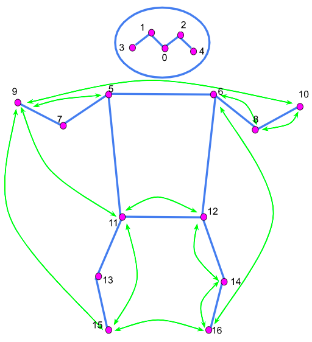
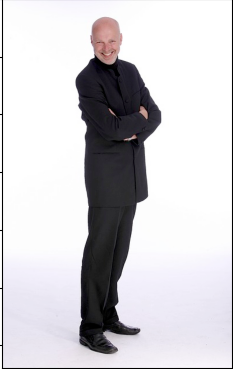
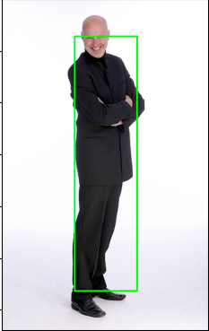
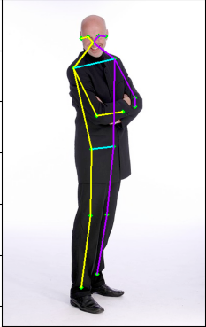
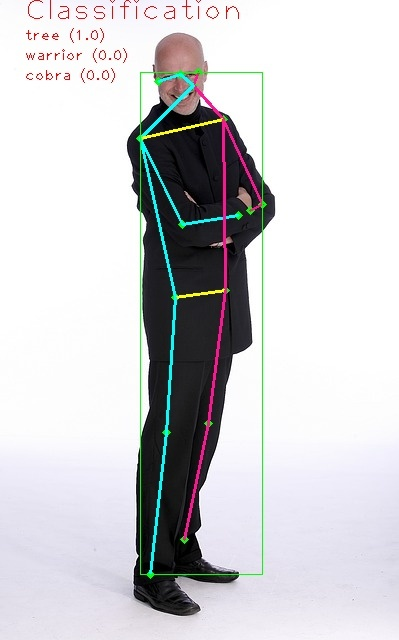

# Pose estimation final project.

This is the final project about `computer vision` using `deep learning` to train model and deploy on `edge device`.

## Pose detection, estimation and classification.

### Flow

### 17 Landmarks keypoints from estimation model

### Structure:

- Project features will be

  - Input image:

    

  - Detection: Output expected.

    

  - Estimation: Output expected.

    

  - Classification: Output expected.

    

### Step by step

- Collect data
- Using TFLite model to estimation yoga pose and get landmarks into csv file
- Define model to training with input as embedding vector from landmark in csv file
- Evaluate model
- Convert model -> TFLite format to deploy on Edge device
- Testing
